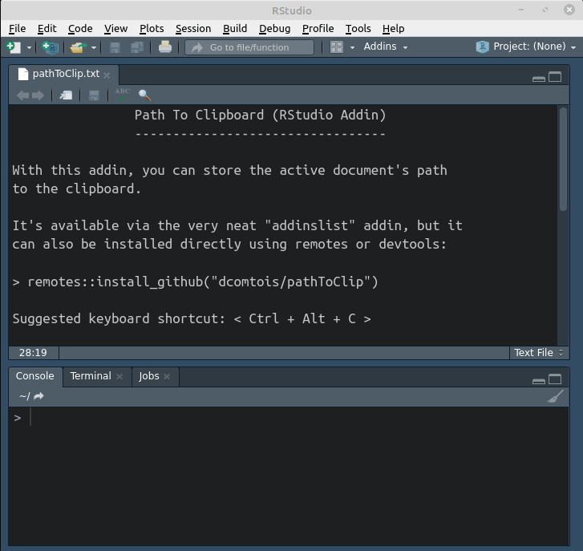

### This "Path To Clipboard" addin for RStudio does **one simple thing**...

## It stores the active document's path into the clipboard.

That's it! Most editors have this feature built-in, but for some reason, RStudio doesn't.

**On OS X and Linux**, it uses the [clipr](https://CRAN.R-project.org/package=clipr) package, which in turn relies on either "xclip" or "xsel", small utilities that can be installed in just a few seconds. See [here](https://linoxide.com/linux-how-to/copy-paste-commands-output-xclip-linux/), for distro-specific instructions.

**On Windows, no additional software is required.**

As with any other addin, you can assign a keyboard shortcut to it. 

I like to use `< Ctrl + Alt + C >`, since it's easy to remember and it's not used by default.

For a simplified version -- one that has only one addin-menu entry and uses the system default path separator -- install version 0.1.0 using devtools or remotes:

```r
remotes::install_github("dcomtois/pathToClip", ref="0-1-0")
```


